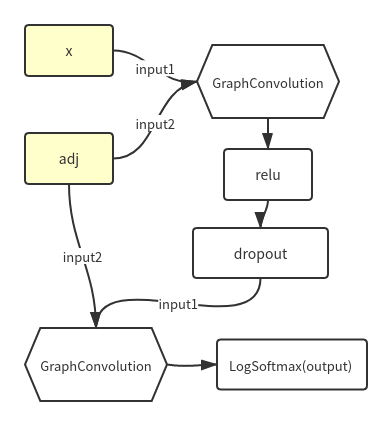

# PYGCN

## 概述

论文地址：[Semi-Supervised Classification with Graph Convolutional Networks](https://arxiv.org/abs/1609.02907)

代码地址：[tkipf/pygcn](https://github.com/tkipf/pygcn)

本例中的GCN的任务是以2708篇论文的特征和引用关系为数据进行训练，实现论文分类。属于图节点分类任务。

本文希望借助对示例代码的分析来了解GCN网络。

## utils.py

### 数据文件

#### cora.cites

```
...
35	97645
35	98698
40	1109017
40	1114442
40	116552
114	1103315
114	1105394
...
```

格式：<被引用文章ID> <引用文章ID>

在graph中表示为被引文指向引文

#### cora.content

```
31336	0	0	0	0	0	...	0	0	0	1	0	0	0	0	0	Neural_Networks
1061127	0	0	0	0	0	...	0	1	0	0	0	0	0	0	0	Rule_Learning
1106406	0	0	0	0	0  	...	0	0	0	0	0	0	0	0	0	Reinforcement_Learning
13195	0	0	0	0	0	...	0	0	0	0	0	0	0	0	0	Reinforcement_Learning
...
```

格式：<文章ID><关键词1><关键词2>...<关键词n><类别>

1和0分别表示关键词是否在文中出现，也作为每个文章的feature。

### 数据预处理

读取数据所形成的数据集主要是adj，features和labels。

#### normalize

本例中的归一化是对矩阵的每一行的元素a, b, c，都乘以一个相同的系数1 / (a+b+c)，使每一行的元素和都为1。

#### adj

```python
    edges_unordered = np.genfromtxt("{}{}.cites".format(path, dataset),
                                    dtype=np.int32)
    edges = np.array(list(map(idx_map.get, edges_unordered.flatten())),
                     dtype=np.int32).reshape(edges_unordered.shape)
    adj = sp.coo_matrix((np.ones(edges.shape[0]), (edges[:, 0], edges[:, 1])),
                        shape=(labels.shape[0], labels.shape[0]),
                        dtype=np.float32)
```

首先读取引用关系文件，生成最初的邻接矩阵A
$$
A_{i, j}=
\begin{cases}
1,&i被j引用（graph中i指向j）\\
0,&otherwise
\end{cases}
$$
A.size() = [num_papers, num_papers]

然后将adj，转换成对称矩阵（symmetric adjacency matrix）。

论文中对symmetric adjacency matrix的描述为
$$
\hat{A}=D^{-\frac12}AD^{-\frac12}
$$
代码中描述为

```python
    adj = adj + adj.T.multiply(adj.T > adj) - adj.multiply(adj.T > adj)
```

可以将此式简化为
$$
\hat A= A+P-Q
$$
其中，
$$
A=adj\\
T=adj.T\\

P=T\ mul\ (T > A)\\
Q=A\ mul\ (T > A)
$$
T是A的转置，所以T的元素
$$
T_{i, j}=
\begin{cases}
1,&j指向i\\
0,&otherwise
\end{cases}
$$
由于邻接矩阵中只有0和1，所以对于T > A，若要元素为True，只能是T为1，A为0，也就是
$$
(T>A)_{i,j}=
\begin{cases}
1,&j指向i且i不指向j\\
0,&otherwise
\end{cases}
$$
所以可知
$$
P_{i,j}=
\begin{cases}
1,&j指向i且i不指向j\\
0,&otherwise
\end{cases}\\
Q_{i,j}=
\begin{cases}
1,&j指向i且i不指向j，且i指向j（不存在）\\
0,&otherwise
\end{cases}
$$
此时再看上述symmetric adjacency matrix，即知
$$
\hat A=
\begin{cases}
1,&i指向j，或j指向i\\
0,&otherwise
\end{cases}
$$
也就是说，上述代码将有向图改为的无向图，矩阵adj也变为相应的无向图的邻近矩阵，当然也就是对称矩阵了。

最后将adj的对角线元素加一然后归一化。

```python
    adj = normalize(adj + sp.eye(adj.shape[0]))
```

#### features

```python
    idx_features_labels = np.genfromtxt("{}{}.content".format(path, dataset),
                                        dtype=np.dtype(str))
    features = sp.csr_matrix(idx_features_labels[:, 1:-1], dtype=np.float32)
    
    features = normalize(features)    
```

特征矩阵非常简单，就是直接读取‘cora.content’中的有无关键字数据，然后作归一化。

#### labels

```python
    idx_features_labels = np.genfromtxt("{}{}.content".format(path, dataset),
                                        dtype=np.dtype(str))
    labels = encode_onehot(idx_features_labels[:, -1])
```

labels是读取了标签数据然后生成的onehot格式矩阵。

## layers.py

本文件定义了层`GraphConvolution`

### 参数

- in_features
- out_features
- weight 网络参数
- bias 网络参数，可选

### 前向传播

#### 代码

```python
    def forward(self, input, adj):
        support = torch.mm(input, self.weight)
        output = torch.spmm(adj, support)
        if self.bias is not None:
            return output + self.bias
        else:
            return output
```

（反向传播由pytorch的autograd自动控制）

#### 计算图


## models.py

本文件定义了整个GCN网络结构

### 前向传播

#### 代码

```python
    def forward(self, x, adj):
        x = F.relu(self.gc1(x, adj))
        x = F.dropout(x, self.dropout, training=self.training)
        x = self.gc2(x, adj)
        return F.log_softmax(x, dim=1)
```

#### 计算图



## train.py

文件定义了训练与测试过程。

其中特征矩阵`features`作为GCN计算图的input1，对称邻接矩阵是GCN计算图的input2。

损失函数：nll_loss

优化器：Adam

## 小结

从计算图角度出发，我们会发现几乎看不出这个网络架构有什么地方和“图”以及“卷积”有关，因为GCN网络的核心在于，其传播公式是精心设计的公式，而且其主要内容是在数据预处理时完成的。
$$
H^{(l+1)}=\sigma(\hat D^{-\frac12}\hat A\hat D^{-\frac12}H^{(l)}W^{(l)})
$$
其中H表示每一层`GraphConvolution`的输入和输出，W是每一层的参数`weight`。

这当中设计了图论和傅里叶变换等数学知识。