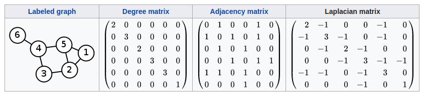

# GCN前置基础

## 拉普拉斯矩阵

### 定义

拉普拉斯矩阵(Laplacian matrix) 也叫做导纳矩阵、**基尔霍夫矩阵**或**离散拉普拉斯算子**，主要应用在图论中，作为一个图的矩阵表示。

对于图 G=(V,E)，其Laplacian 矩阵的定义为
$$
L = D - A
$$
其中L就是拉普拉斯矩阵，而D是顶点的度矩阵，其对角线元素依次为各个顶点的度， A 是图的邻接矩阵。

对于无向图，拉普拉斯矩阵如下图

### 常用的几种形式

#### 普通形式的拉普拉斯矩阵

即上述定义中的形式。

#### 对称归一化的拉普拉斯矩阵（Symmetric normalized Laplacian）

$$
L^{sys}=D^{-1/2}LD^{-1/2}=I-D^{-1/2}AD^{-1/2}
$$

此时，矩阵的元素为
$$
L^{sys}_{i, j}
\begin{cases}
1&i=j\ and\ diag(v_i)\ne0\\
-\frac1{\sqrt{diag(v_i)diag(v_j)}}&i\ne j\ and\ v_i\ is\ adjacent\ to\ v_j\\
0&otherwise
\end{cases}
$$

### 无向图的矩阵性质

1. 拉普拉斯矩阵是半正定矩阵。（最小特征值大于等于0）
2. **特征值中0出现的次数就是图连通区域的个数**
3. 最小特征值是0，因为拉普拉斯矩阵（普通形式：*L*=*D*-*A*L=D-A）每一行的和均为0，并且**最小特征值对应的特征向量是每个值全为1的向量**
4. 最小非零特征值是图的代数连通度