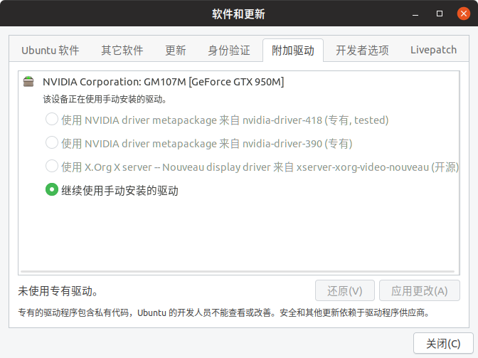
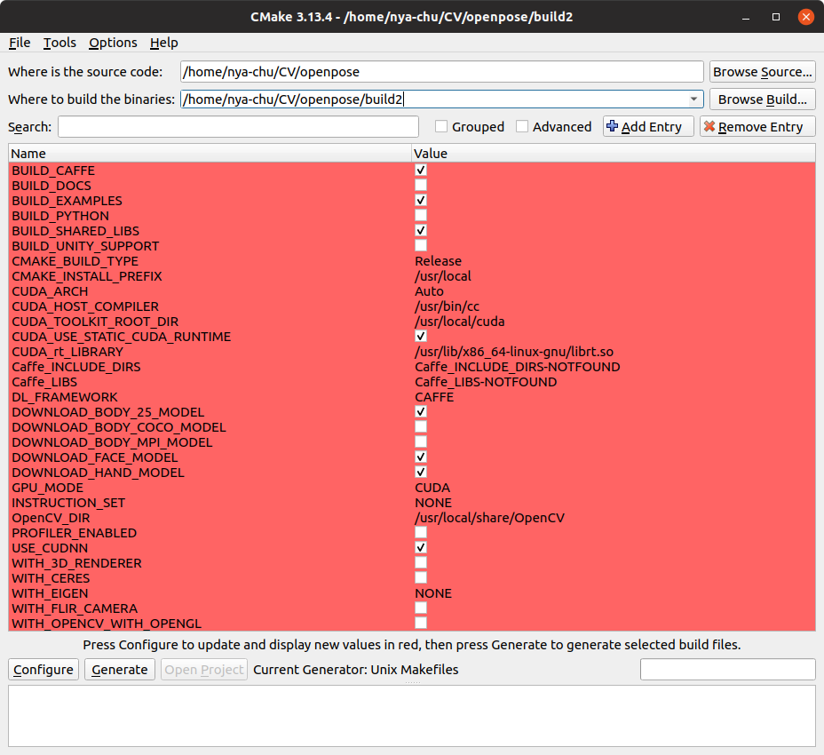
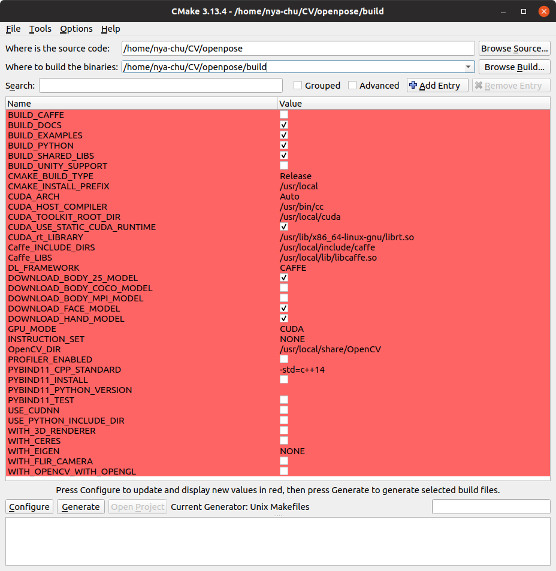
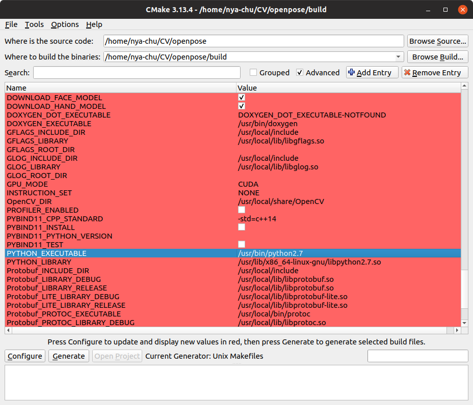

# OpenPose + Python Wrapper 安装

## 参考资料

- https://github.com/CMU-Perceptual-Computing-Lab/openpose/blob/master/doc/installation.md#requirements-and-dependencies
- https://github.com/CMU-Perceptual-Computing-Lab/openpose/blob/master/doc/prerequisites.md
- https://www.cnblogs.com/chendl111/p/9461154.html
- https://github.com/CMU-Perceptual-Computing-Lab/openpose/blob/master/doc/modules/python_module.md

## 系统环境

- Ubuntu 19.04

 (截至发表时官方已推出19.10版本，但依然建议先安装19.04版本)，推荐`/`和`/home`分别挂载100G磁盘空间。

- NVIDIA GPU

## 前置依赖

### Anaconda

官方：安装完成之前**不要**安装Anaconda。

### CUDA

cuda的安装步骤很多，可以参考[ubuntu 19.10安装Nvidia显卡驱动以及CUDA和cudnn](https://blog.csdn.net/ZeroDegree1216/article/details/103534044)

照搬其步骤前注意：

- 若某一步骤有出入，可以自行查找其他有关ubuntu19.04或18版本安装Cuda的教程；
- Ubuntu自带gcc和g++8.3.0，满足安装需要；
- Ctrl+alt+Fx 进入非图形终端后，可能会因未知原因无法切换回图形终端，所以在切换前请先保存好自己的工作，文字端工作完成后，输入`reboot`即可重启回到图形界面；
- 有关“lightdm”的命令可能无效，无效则无视；
- 驱动安装完成后的“软件与更新”界面：



- 我的cuda版本是：

```shell
nya-chu@Lenovo-ideapad-Ubuntu1904:~$ nvcc --version
nvcc: NVIDIA (R) Cuda compiler driver
Copyright (c) 2005-2019 NVIDIA Corporation
Built on Wed_Oct_23_19:24:38_PDT_2019
Cuda compilation tools, release 10.2, V10.2.89
```

### OpenCV

- 推荐源码编译安装

- V3.4.9 (官方：all 2.X and 3.X versions are **compatible**)

- 安装依赖

```shell
sudo apt-get install build-essential
sudo apt-get install cmake git libgtk2.0-dev pkg-config libavcodec-dev libavformat-dev libswscale-dev
```

- 下载source

https://opencv.org/releases/

- cmake

```shell
cd opencv-3.4.9
mkdir build
# 创建编译文件
cd build
cmake -D CMAKE_BUILD_TYPE=Release -D CMAKE_INSTALL_PREFIX=/usr/local ..
# 生成的编译配置即在build目录下
```

- make编译安装

```shell
make -j2
sudo make install
```

### CMake-GUI

```shell
sudo apt-get install cmake-qt-gui
```

### Caffe

安装OpenPose时可以自动安装Caffe，但是若想安装op的python wrapper，则需要先安装好Caffe。

安装Caffe，使用apt自动安装的caffe往往出错，手动安装时，除了常规的make编译步骤，还要自行设置配置文件，大多数教程十分繁琐。出于以上几点，我选择走一条捷径：通过两次编译OpenPose实现Caffe的预安装。当然也可以按网上的教程

无论是否选择走捷径，都要先安装Caffe的依赖：

```shell
### INSTALL PREREQUISITES

# Basic
sudo apt-get --assume-yes update
sudo apt-get --assume-yes install build-essential
# General dependencies
sudo apt-get --assume-yes install libatlas-base-dev libprotobuf-dev libleveldb-dev libsnappy-dev libhdf5-serial-dev protobuf-compiler
sudo apt-get --assume-yes install --no-install-recommends libboost-all-dev
# Remaining dependencies, 14.04
sudo apt-get --assume-yes install libgflags-dev libgoogle-glog-dev liblmdb-dev
```

## OpenPose

### 下载源码

```shell
git clone git@github.com:CMU-Perceptual-Computing-Lab/openpose.git
git submodule update --init --recursive
```

### 手动下载模型文件

按照官方指示下载文件到指定目录：

```
- [BODY_25 model](http://posefs1.perception.cs.cmu.edu/OpenPose/models/pose/body_25/pose_iter_584000.caffemodel): download in `models/pose/body_25/`.
- [COCO model](http://posefs1.perception.cs.cmu.edu/OpenPose/models/pose/coco/pose_iter_440000.caffemodel): download in `models/pose/coco/`.
- [MPI model](http://posefs1.perception.cs.cmu.edu/OpenPose/models/pose/mpi/pose_iter_160000.caffemodel): download in `models/pose/mpi/`.
- [Face model](http://posefs1.perception.cs.cmu.edu/OpenPose/models/face/pose_iter_116000.caffemodel): download in `models/face/`.
- [Hands model](http://posefs1.perception.cs.cmu.edu/OpenPose/models/hand/pose_iter_102000.caffemodel): download in `models/hand/`.

```

### 第一次编译

本次编译，我们：检查cuDNN，编译Caffe，检查整个OpenPose环境。

在OpenPose目录下新建build2目录作为编译目标位置，在CMake-GUI中选好源目录和目标目录，点击Configure，选择Unix Makefiles和default native compiler，配置如下图。



点击Generate。

在build2中编译：

```shell
cd build2
make -j2
```

测试demo：

```shell
# 注意当前shell所在的路径是根目录
nya-chu@Lenovo-ideapad-Ubuntu1904:~/CV/openpose$ ./build2/examples/openpose/openpose.bin --video examples/media/video.avi --net_resolution "128x-1"
```

如果报有关cuDNN的错误（oom除外），先尝试重启电脑，若仍然失败，那么有可能是cuDNN有问题。这时需要重新编译：

如果运行过`sudo make install`，那么要先`sudo make uninstall`，然后删除整个build2文件夹，在CMake-GUI中点击Delete Cache.

重新按上文的步骤在build2下进行编译，注意要取消勾选`USE_CUDNN`选项。

重新进行测试。

测试通过后：
```shell
cd build2
sudo make install
```

### 第二次编译

本次编译，我们：安装OpenPose，安装op的python接口。

新建build目录，Configure后，基础配置如下图，**注意此时与之前的配置已有所不同**。



Pybind默认选择最新的python版本，如果要指定安装到某个python，如python2.7，则需要继续配置：

勾选CMake-GUI的Advanced，找到PYTHON开头的两项进行合适的设置，例如下图：


然后Generate，在build中重复之前的步骤，直到完成demo测试。

### Python测试

```shell
cd /build/examples/tutorial_api_python
python 01_body_from_image.py
```

### 完成安装

```shell
cd build
sudo make install
```

## 其他

不推荐使用虚拟机安装ubuntu，除非电脑性能强大。

关于前置依赖的安装，网络上有海量的中文教程，不一定必须按本文的教程进行安装。
