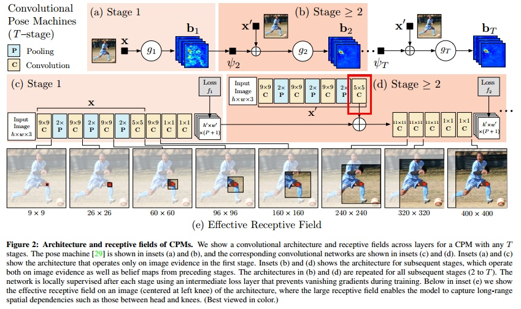
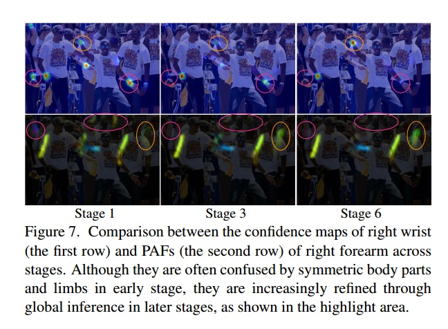
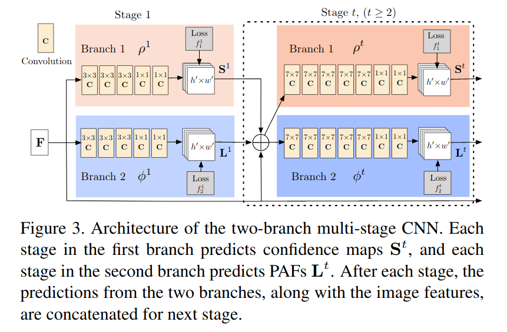

# OpenPose算法与网络结构

## 主要算法

### CPM算法思想

Convolutional Pose Machine（CPM）用于单人姿态估计。

CPM的模型采用的大卷积核来获得大的感受野，这对于推断被遮挡的关节很有效。网络结构如下图。

整个算法的流程是：

1. 首先对图像的所有出现的人进行回归，回归各个人的关节的点
2. 然后根据center map来去除掉对其他人的响应
3. 最后通过重复地对预测出来的heatmap进行refine得到最终的结果

在进行refine的时候，需要引入中间层的loss，从而保证较深的网络仍然可以训练下去，不至于梯度消失或者爆炸。

### Realtime Multi-Person Pose Estimation算法思想

多人姿态估计。

#### part affine field(PAF)

PAF实际上就是两个关节之间的连接所产生的heatmap:

OpenPose使用的是自底向上的方法，即先回归出所有人的关节点，然后再对这些关节点进行划分，这样就可以把关节分配到每个人。

#### 网络结构

该网络的结构与CPM其实很类似，也是通过CPM的方式先将一幅图中所有人的关节点都回归出来，此外还同时回归出PAF。

PAFs用来描述像素点在骨架中的走向，用L表示；关键点的响应用S表示。先看主体网络结构，网络采用VGG pre-train network作为骨架，有两个分支分别回归L和S。每一个stage算一次loss，之后把L和S以及原始输入concatenate，继续下一个stage的训练。随着迭代次数的增加，S能够一定程度上区分结构的左右。loss用的L2范数，S和L的ground-truth需要从标注的关键点生成，如果某个关键点在标注中有缺失则不计算该点。

> https://www.zhihu.com/question/59750782
>
> https://blog.csdn.net/Hibercraft/article/details/79377997

## 网络结构

OpenPose使用Caffe为深度计算框架，网络结构很深，其中身体姿态`body_25`模型346层，手部模型131层，面部模型131层layers。

[body_25模型结构](../res/body_25.prototxt)

[手部模型结构](../res/hand.prototxt)

[面部模型结构](../res/face.prototxt)

